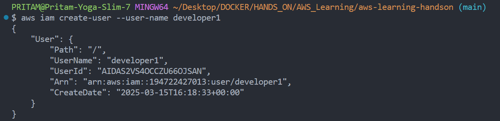
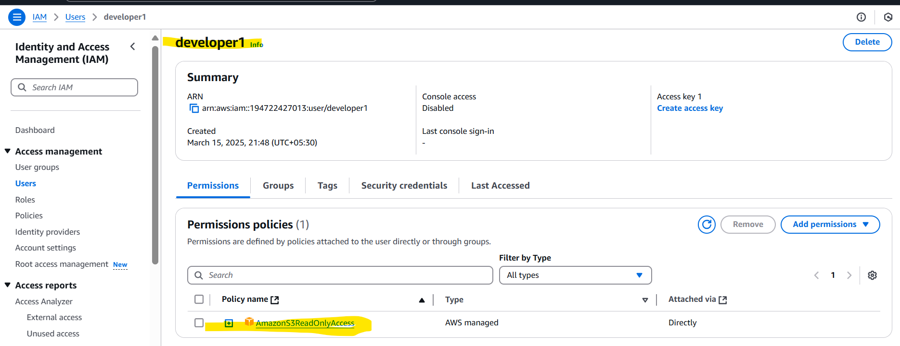

# Hands-on IAM Practice Questions (Use-Case Based)
## Here are practical IAM exercises to help you get hands-on experience within the AWS Free Tier:

1. Q: User Management : 
    - Create an IAM user named **`developer1`** with programmatic access only and assign the **`AmazonS3ReadOnlyAccess`** policy.
    - Create another IAM user named **`developer2`** with console access only and a custom password.
    - Set up a password policy requiring at least 8 characters, uppercase, lowercase, numbers, and symbols.
    -   Enable MFA for one of the users and enforce MFA authentication before accessing the AWS Management Console.

> Ans (Given By Me): 
>
```sh
aws iam create-user --user-name developer1
aws iam attach-user-policy --user-name developer1 --policy-arn "arn:aws:iam::aws:policy/AmazonS3ReadOnlyAccess"
```
1. 
1. 

My addition>
```sh
aws iam create-login-profile --user-name developer1 --password-reset-required --password "ChangePwd@123"
```

>[!TIP]
>
>CHATGPT Ans:
>Your answer is mostly correct, but it is missing the step to create programmatic access credentials for the user. Here's the corrected approach:
>
>Correct Answer
>```sh
># Step 1: Create IAM user
>aws iam create-user --user-name developer1
>
># Step 2: Create access keys for programmatic access
>aws iam create-access-key --user-name developer1
>
># Step 3: Attach AmazonS3ReadOnlyAccess policy
>aws iam attach-user-policy --user-name developer1 --policy-arn "arn:aws:iam::aws:policy/AmazonS3ReadOnlyAccess"
>```


----

2. Group and Role-Based Access Control
Create an IAM group named Developers and attach AmazonEC2ReadOnlyAccess to the group.
Add developer1 and developer2 to this group and verify if they can access EC2 instances in read-only mode.
Create an IAM role for an EC2 instance with AmazonS3FullAccess. Launch an EC2 instance and attach the role. Verify if the instance can list and upload files to S3.

----
3. Custom Policies and Least Privilege
Create a custom IAM policy that allows only listing S3 buckets but not accessing objects inside. Attach this policy to developer1 and test it.
Modify the above policy to allow developer1 to upload objects but only in a specific bucket.
Create a custom IAM policy that restricts access to EC2 but allows listing only instances with the tag Environment=Dev.

----
4. Permissions Boundaries & Access Control
Set a permissions boundary for developer2 so that they can only create and manage IAM users without modifying their own permissions.
Create a role that allows access to DynamoDB, but only within a specific AWS region.

----
5. Cross-Account IAM Access (If you have another AWS account to test with)
Create a cross-account IAM role allowing users from another AWS account to assume the role with ReadOnlyAccess to S3.
Generate temporary security credentials using AWS STS for a role and verify access using the AWS CLI.