# aws-learning-handson

this repo is created store all learning and hands-on practice of aws EC2

## Tech Stack

> 

---

### Q1. What is EC2 Instance?

> [!NOTE]
>
> 1.  It is like requesting Amazone for a VM with specified CPU, RAM , DISK
>
> 1.  EC2 - stands for ECC `--->` **Elastic Compute Cloud**
>
> 1.  Here **Elastic** stands for which instances can be scaled up/down.
>
> 1.  These are all **Pay as You Go** services.

### Q2. what are the type of EC2 instances?

> [!NOTE]
>
> 1.  General purpose
> 1.  Compute Optimized
> 1.  Memory Optimized
> 1.  Storage Optimized
> 1.  Accelerated Optimized

### Q3. Region & Availability Zone ?

> Region Example :
>
> 

### How to create EC2 instancs?

1. Go dashboard and search for EC2 --> launch instance.
1. Page will look like below
   - 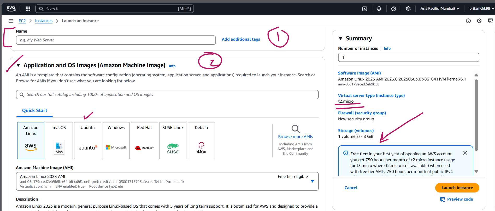
   - 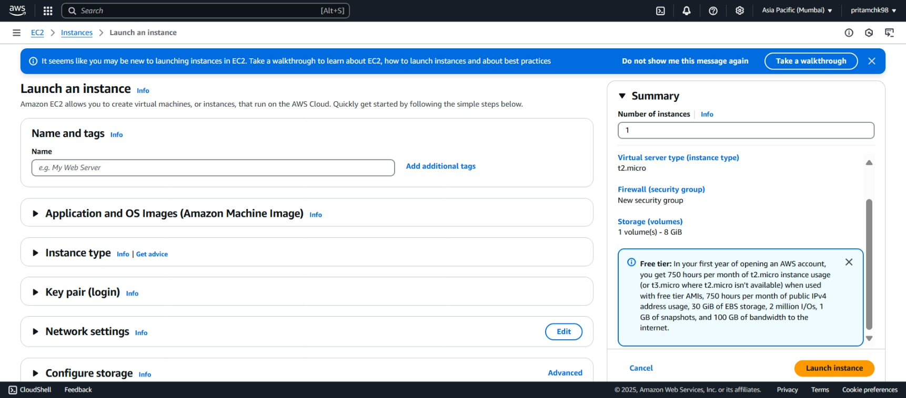
1. Create key-pair which will be required to connect to VM through putty/winscp/terminal.
   - 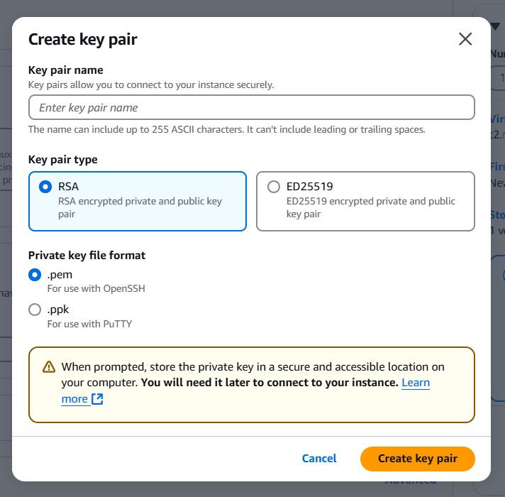
1. To allow all traffic from internet to access the public ip of EC2 instance tick✅ the below check box :
   - 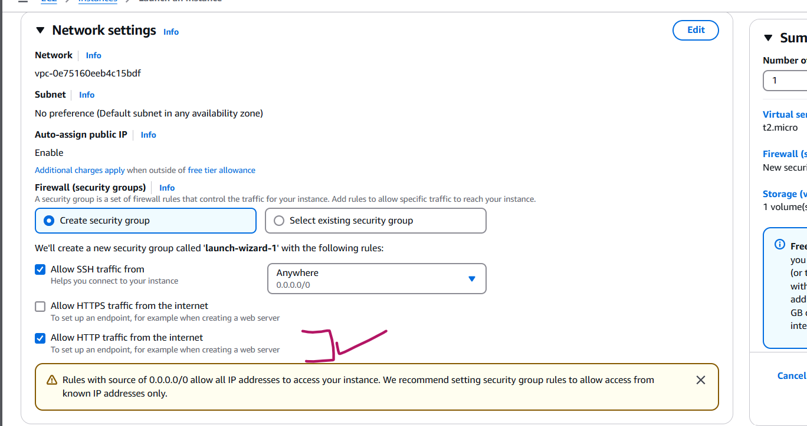
1. Give info and start instance , to spin up the VM.
   - 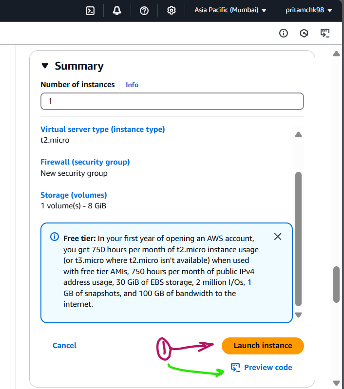
1. Success.

   - 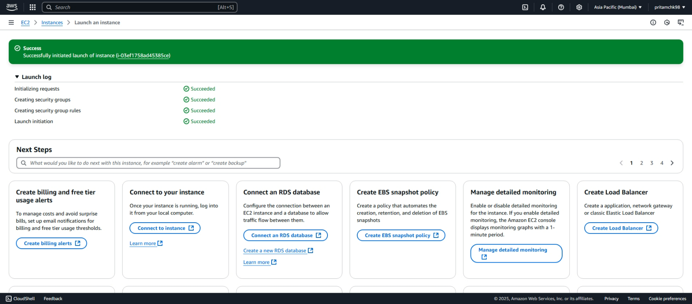
   - 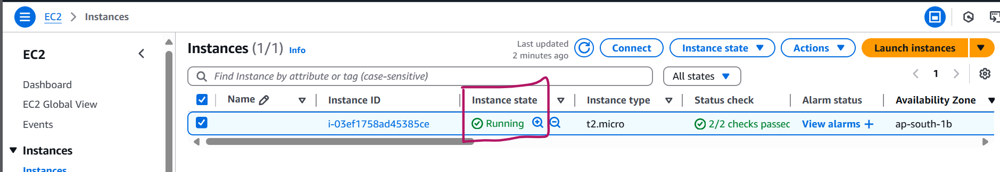
   - 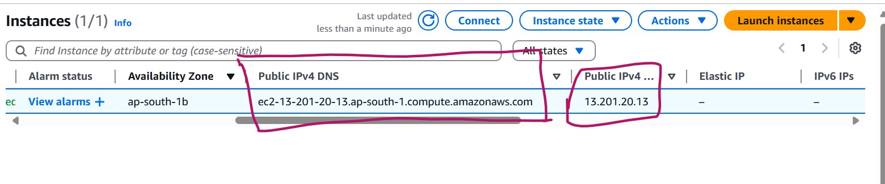

1. Now connect to the instance / VM from terminal

   - > ```
     > PRITAM@Pritam-Yoga-Slim-7 MINGW64 ~/Desktop/DOCKER/HANDS_ON/AWS_Learning/aws-learning-handson/2_EC2 (main)
     > $ ssh -i aws_1st_ec2_vm.pem ubuntu@13.201.20.13
     >
     >
     >
     >
     >
     > 
   - 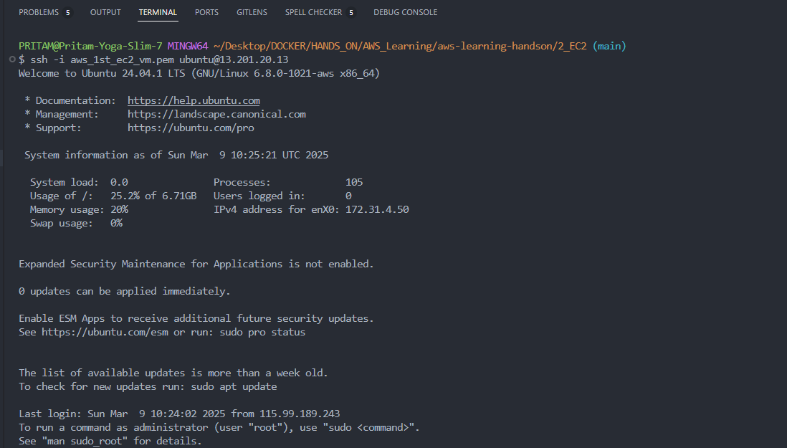

1. Install gitea in aws ec2 instance.
   - 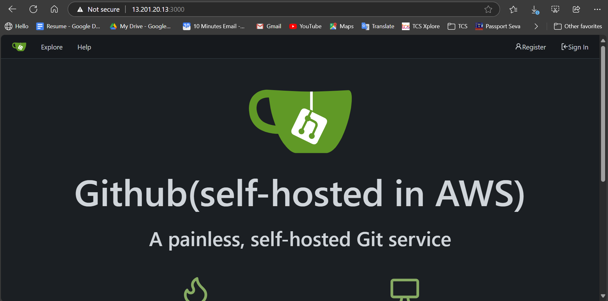
   - 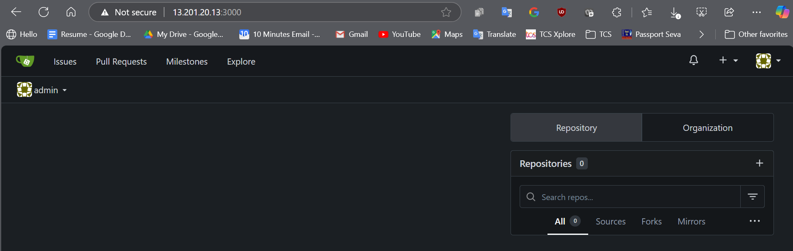
1. to install connect to aws ec2 vm through terminal and then follow usual gitea installation steps for a binary.

```sh
wget https://dl.gitea.com/gitea/1.23.5/gitea-1.23.5-linux-amd64

chmod 755
chmod 755 gitea-1.23.5-linux-amd64
nohup ./gitea-1.23.5-linux-amd64 web -p 80 -c ./app.ini > startLog.out &
```

1. change inbound traffic rule in security to allow all traffic
   - 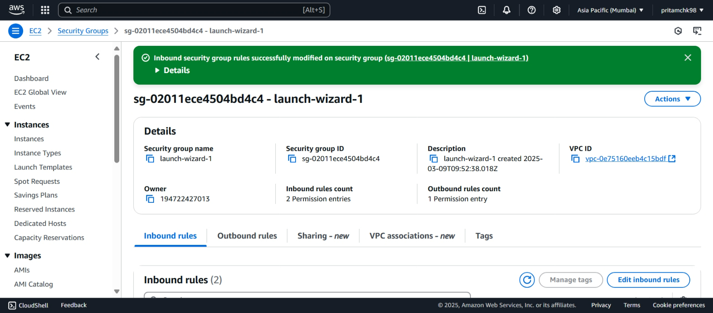
   - 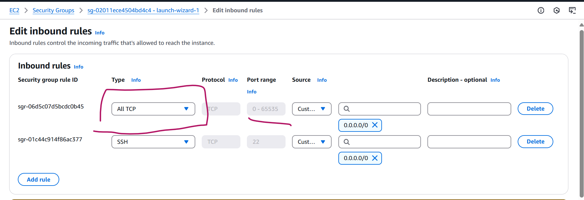
