## Create custom VPC & Use in EC2 instance

1. The VPC Page looks like below
   - 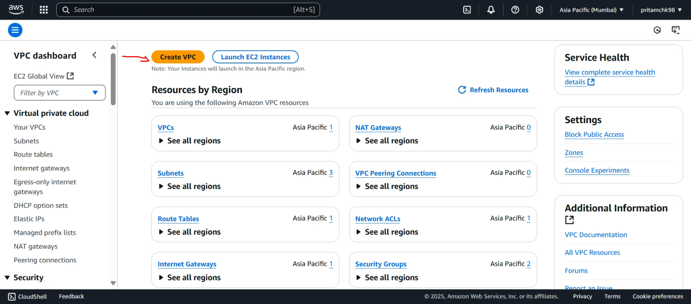
1. Create VPC and More
   - 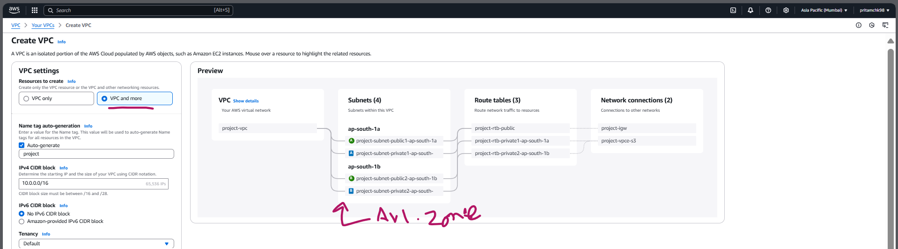
   - here Public and Private Netword will be there by default for Availability zone (2) - like 1a & 1b
1. Creation time :
   - 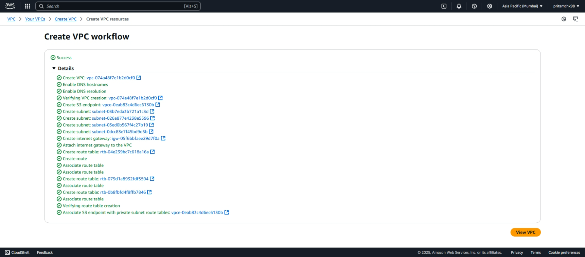
1. Open VPC - NACL to check the inbound rule
   - 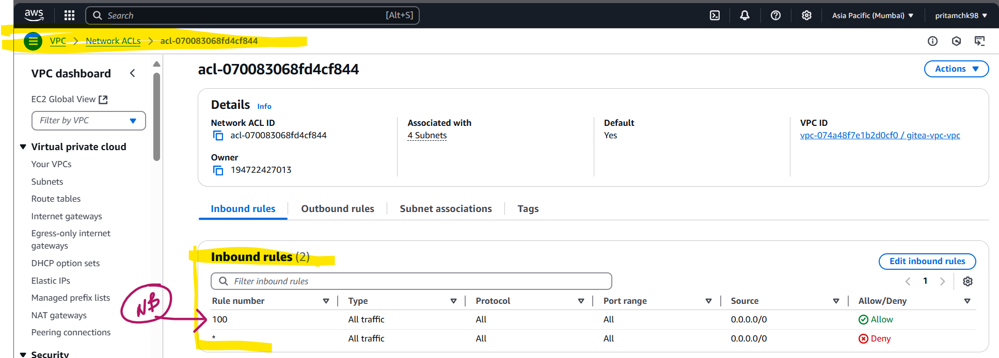
   - Here 100 `--->` is priority no for a rule, where lower the number `===>` Higher the priority :
     - 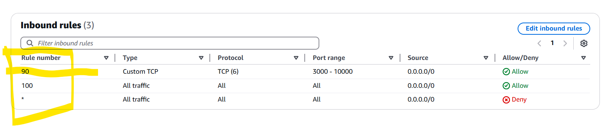
   - Which means the top most priority rule will be implemented / used.
1. By default AWS adds **Security Group** to EC2 instance to protect it and won't allow any traffic from outside.
1. So now task is to create an EC2 instance with created VPC and do perform below task:
   1. then assigned the VPC to that EC2 instance
   1. for that VPC already allowed some rule before
   1. Change in **SG[Sec. Group]** - to allow only port 13000
   1. check gitea app accessible or not :
      - 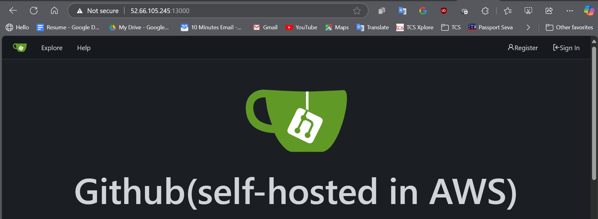
      - 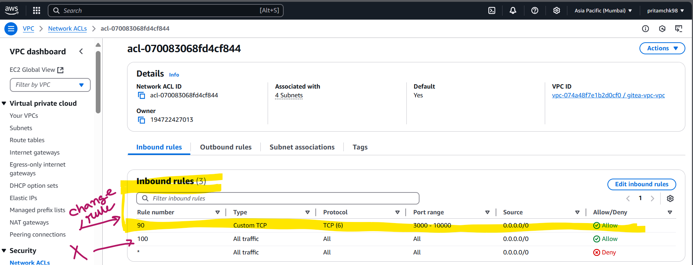
      - Now change the rule to deny any traffic on 13000 port and check the app :
      - 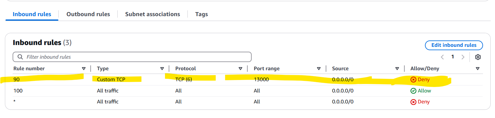
      - 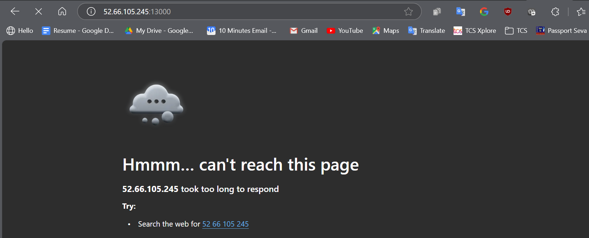
      - Now change the priority in NACL from `90` `-->` `110` and then check app access : [ prediction : it should be accessible ]
      - 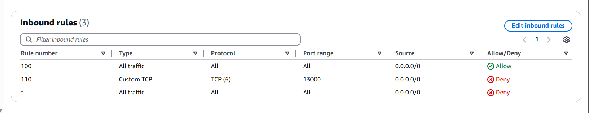
      - 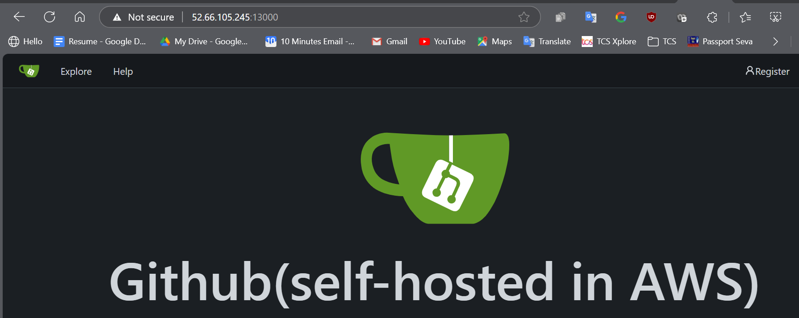
   1. So over all idea got for NACL and SG.

> [!WARNING]
>
> While creating VPC - I have not associated any public ip by default option , so later on I have to create Elastic IP for it and Associate with the network - **which is chargeable** .
>
> So once PoC done , do disassociate the Ip from network and then release it .
>
> - 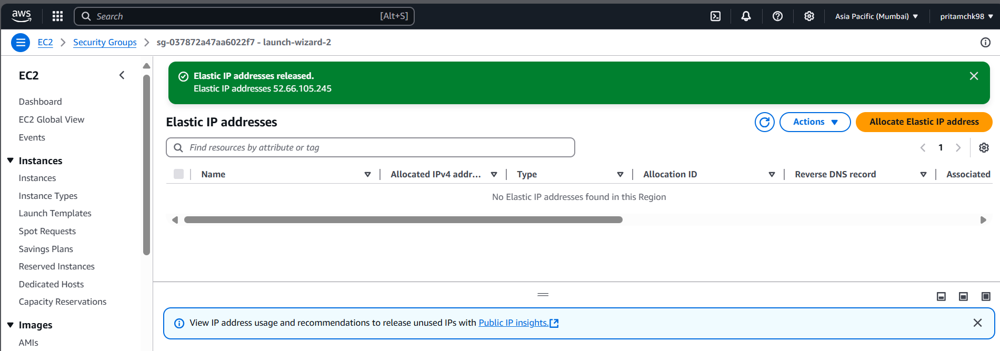
> - 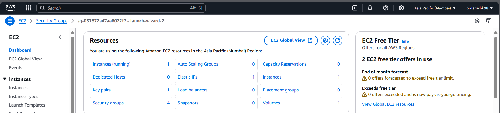
