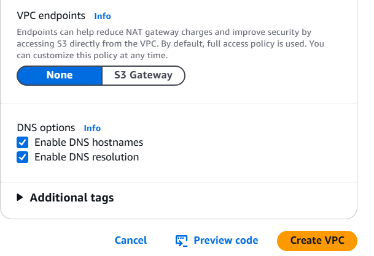
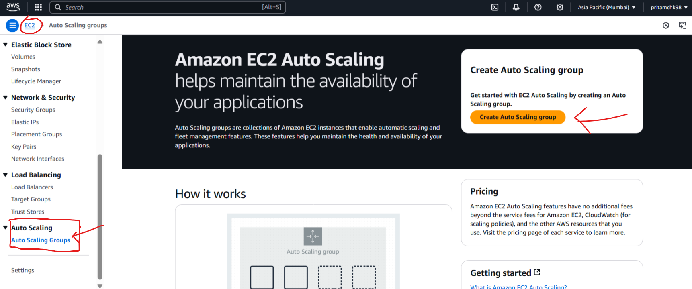
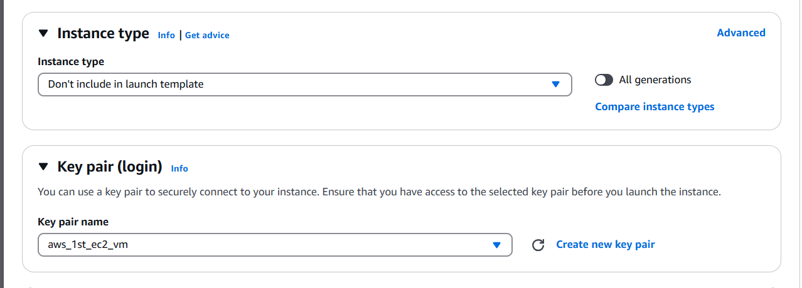

## Tech Stack

> 

---

## In this I will try to Create / Implement Production Like System for an application in AWS


---

## Steps :

### 1. Create VPC

```bash
aws ec2 create-vpc --cidr-block "10.0.0.0/24" --instance-tenancy "default" --tag-specifications '{"resourceType":"vpc","tags":[{"key":"Name","value":"prod-sample-vpc"}]}'
aws ec2 modify-vpc-attribute --vpc-id "preview-vpc-1234" --enable-dns-hostnames '{"value":true}'
aws ec2 describe-vpcs --vpc-ids "preview-vpc-1234"
aws ec2 create-subnet --vpc-id "preview-vpc-1234" --cidr-block "10.0.0.0/28" --availability-zone "ap-south-1a" --tag-specifications '{"resourceType":"subnet","tags":[{"key":"Name","value":"prod-sample-subnet-public1-ap-south-1a"}]}'
aws ec2 create-subnet --vpc-id "preview-vpc-1234" --cidr-block "10.0.0.16/28" --availability-zone "ap-south-1b" --tag-specifications '{"resourceType":"subnet","tags":[{"key":"Name","value":"prod-sample-subnet-public2-ap-south-1b"}]}'
aws ec2 create-subnet --vpc-id "preview-vpc-1234" --cidr-block "10.0.0.128/28" --availability-zone "ap-south-1a" --tag-specifications '{"resourceType":"subnet","tags":[{"key":"Name","value":"prod-sample-subnet-private1-ap-south-1a"}]}'
aws ec2 create-subnet --vpc-id "preview-vpc-1234" --cidr-block "10.0.0.144/28" --availability-zone "ap-south-1b" --tag-specifications '{"resourceType":"subnet","tags":[{"key":"Name","value":"prod-sample-subnet-private2-ap-south-1b"}]}'
aws ec2 create-internet-gateway --tag-specifications '{"resourceType":"internet-gateway","tags":[{"key":"Name","value":"prod-sample-igw"}]}'
aws ec2 attach-internet-gateway --internet-gateway-id "preview-igw-1234" --vpc-id "preview-vpc-1234"
aws ec2 create-route-table --vpc-id "preview-vpc-1234" --tag-specifications '{"resourceType":"route-table","tags":[{"key":"Name","value":"prod-sample-rtb-public"}]}'
aws ec2 create-route --route-table-id "preview-rtb-public-0" --destination-cidr-block "0.0.0.0/0" --gateway-id "preview-igw-1234"
aws ec2 associate-route-table --route-table-id "preview-rtb-public-0" --subnet-id "preview-subnet-public-0"
aws ec2 associate-route-table --route-table-id "preview-rtb-public-0" --subnet-id "preview-subnet-public-1"
aws ec2 create-route-table --vpc-id "preview-vpc-1234" --tag-specifications '{"resourceType":"route-table","tags":[{"key":"Name","value":"prod-sample-rtb-private1-ap-south-1a"}]}'
aws ec2 associate-route-table --route-table-id "preview-rtb-private-1" --subnet-id "preview-subnet-private-2"
aws ec2 create-route-table --vpc-id "preview-vpc-1234" --tag-specifications '{"resourceType":"route-table","tags":[{"key":"Name","value":"prod-sample-rtb-private2-ap-south-1b"}]}'
aws ec2 associate-route-table --route-table-id "preview-rtb-private-2" --subnet-id "preview-subnet-private-3"
aws ec2 describe-route-tables --route-table-ids   "preview-rtb-private-1" "preview-rtb-private-2"
```

- 
- | VPC                           | Creation                      |
  | ----------------------------- | ----------------------------- |
  |  |  |
  |  |  |
- 

### 1. Create Auto Scaling group for EC2 instance

1. 
1. 
1. 
1. 
1. 
1. 
1. 
1. 
1. 
1. 
1. 
1. 
1. 
1. 
1. 
1. 

> ```sh
> aws autoscaling create-auto-scaling-group --auto-scaling-group-name "prod-auto-scale-grp" --max-size "4" --min-size "1" --desired-capacity "2" --health-check-grace-period "300" --default-instance-warmup "-1" --launch-template '{}' --availability-zone-distribution '{"CapacityDistributionStrategy":"balanced-best-effort"}' --mixed-instances-policy '{"InstancesDistribution":{"OnDemandAllocationStrategy":"prioritized","OnDemandBaseCapacity":0,"OnDemandPercentageAboveBaseCapacity":100,"SpotAllocationStrategy":"price-capacity-optimized"},"LaunchTemplate":{"Overrides":[{"InstanceType":"t2.micro","WeightedCapacity":"2"}],"LaunchTemplateSpecification":{"LaunchTemplateId":"lt-0410899536850e48d","Version":"$Default"}}}' --vpc-zone-identifier "subnet-0c5c321a53f34b121,subnet-0957fd79d32d55a67" --health-check-type "EC2" --capacity-reservation-specification '{"CapacityReservationPreference":"default"}'
> ```

## to launch similar instance :

1. 

> [!WARNING]
>
>  > 
>
> #### need to understand autoscaling group more

## Create Jump server to connect to private subnet vms

1. 
1. 

> 52.66.201.128

#### keep the .pem file in jump server

```sh
PRITAM@Pritam-Yoga-Slim-7 MINGW64 ~/Desktop/DOCKER/HANDS_ON/AWS_Learning/aws-learning-handson (main)
$ scp -i 2_EC2/aws_1st_ec2_vm.pem 2_EC2/aws_1st_ec2_vm.pem ubuntu@52.66.201.128:/home/ubuntu/
aws_1st_ec2_vm.pem
```

```
100% 1674    51.5KB/s   00:00
```

```sh
PRITAM@Pritam-Yoga-Slim-7 MINGW64 ~/Desktop/DOCKER/HANDS_ON/AWS_Learning/aws-learning-handson (main)
$
ssh -i 2_EC2/aws_1st_ec2_vm.pem ubuntu@52.66.201.128
```

#### Then from jump server connect to vm1 and vm2

> vm2 connection:

```sh
ubuntu@ip-10-0-0-10:~$ chmod 600 aws_1st_ec2_vm.pem
ubuntu@ip-10-0-0-10:~$ ssh -i aws_1st_ec2_vm.pem ubuntu@10.0.0.142
```

#### Run a web project in vm2 / vm1

> Here I'm running the web page from vm2 | so copied those files through scp in to
>
> **10.0.0.142** server

```sh
ubuntu@ip-10-0-0-10:~$ ls -1 *.html *.js *.css | xargs -I {} scp -i aws_1st_ec2_vm.pem {} ubuntu@10.0.0.154:/home/ubuntu/
The authenticity of host '10.0.0.154 (10.0.0.154)' can't be established.
ED25519 key fingerprint is SHA256:RkSi9B6rwVJKVBHO0Rbpio0CtQvIP0sxnnTr9tX5PuY.
This key is not known by any other names.
Are you sure you want to continue connecting (yes/no/[fingerprint])? yes
Warning: Permanently added '10.0.0.154' (ED25519) to the list of known hosts.
index.html                                                                 100% 5203     4.4MB/s   00:00
script.js                                                                  100% 1200   715.7KB/s   00:00
server.js                                                                  100%  468   553.6KB/s   00:00
styles.css                                                                 100% 1994     1.2MB/s   00:00
ubuntu@ip-10-0-0-10:~$ ssh -i aws_1st_ec2_vm.pem ubuntu@10.0.0.154
```

#### Create load balancer

1. 
1. Create target group for it > select VMs in private subnet.
1. all inbound rule in security group post load-balancer is launched successfully.

> [!Tip]
>
> in node 2 same code base kept to run , just for verification purpose of load balancer working or not
>
> changed below content oin html file :
>
> - 
>
> start the python server in node 2 also
>
> `python3 -mm http.server 8000`
>
> now trying to reach the web few times and check
>
> - 
> - 
>
> after some more refresh :
>
> - 
> - 

# So It's the end:

## Hosted own resume web page in aws

> - 
