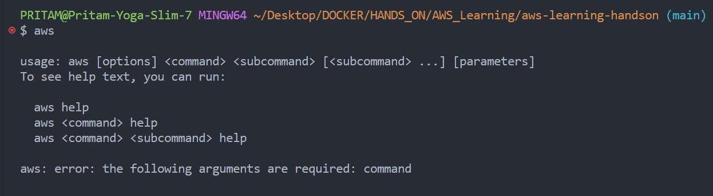
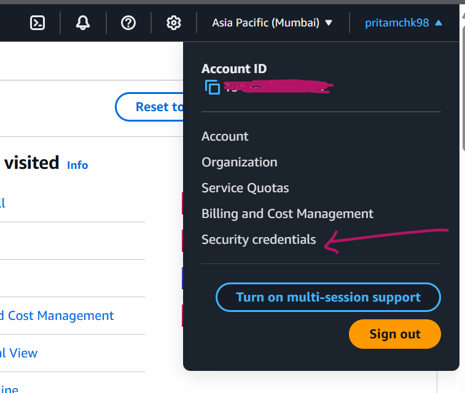
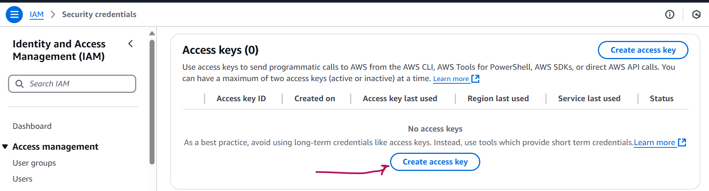
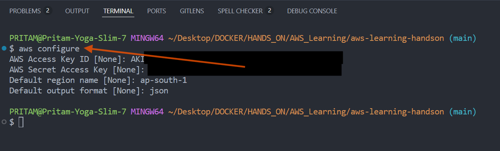
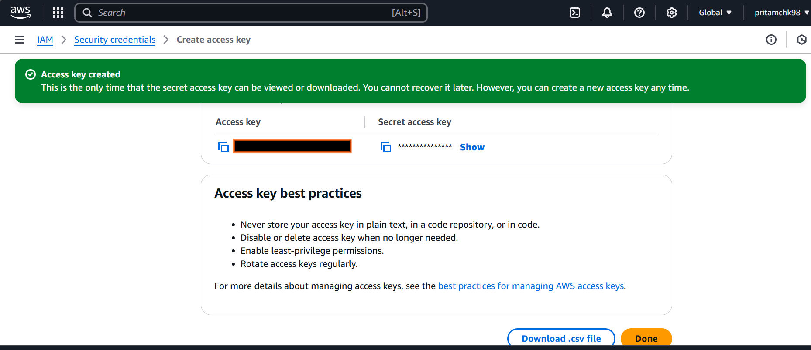
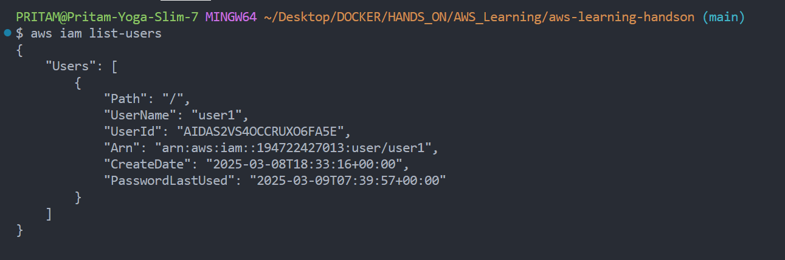
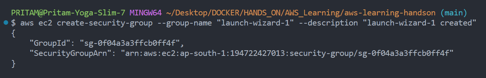
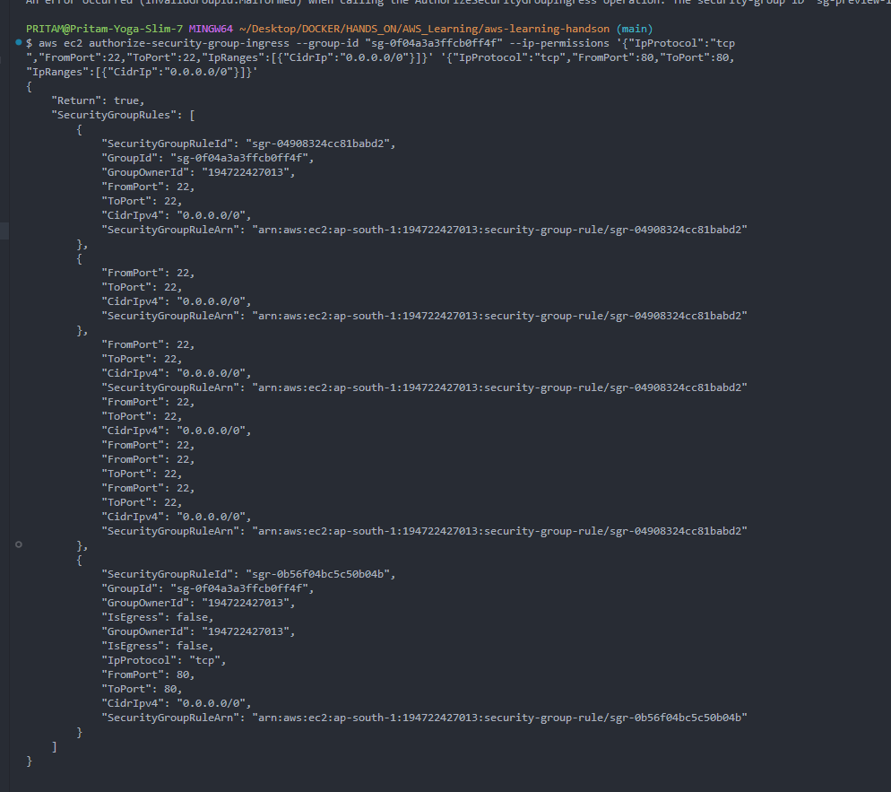
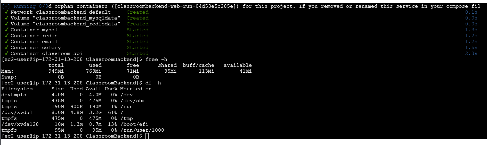

# install AWS CLI

---

> here I have installed on Windows system
>
> Donwload Link and DOC:
>
> [https://docs.aws.amazon.com/cli/latest/userguide/getting-started-install.html](https://docs.aws.amazon.com/cli/latest/userguide/getting-started-install.html)
>
> or
>
> ```ps
> msiexec.exe /i https://awscli.amazonaws.com/AWSCLIV2.msi
> ```

> [!NOTE]
>
> add the installed exe file path in environment variable
>
> - 

---

# Connect to AWS account through CLI

> [!DANGER]
> Ideally I should access IAM user , but now I'll go ahead with root user -->

1. login to root/iam user
   - 
1. Then Create the Access Key
   - 
1. Configure in aws cli
   - 
   - 

# Example: Post connection :

1. `aws iam list-users`

   - 

1. Create EC2 Instance
   - CreateSecurityGroup
     ```sh
     aws ec2 create-security-group --group-name "launch-wizard-1" \
     --description "launch-wizard-1 created" \
     ```
     - 
   - AuthorizeSecurityGroupIngress
     ```sh
     aws ec2 authorize-security-group-ingress --group-id "sg-0f04a3a3ffcb0ff4f" --ip-permissions '{"IpProtocol":"tcp","FromPort":22,"ToPort":22,"IpRanges":[{"CidrIp":"0.0.0.0/0"}]}' '{"IpProtocol":"tcp","FromPort":80,"ToPort":80,"IpRanges":[{"CidrIp":"0.0.0.0/0"}]}'
     ```
     - 
   - RunInstances
     ```sh
     aws ec2 run-instances --imgs/image-id 'ami-05c179eced2eb9b5b' --instance-type "t2.micro" --key-name "aws_1st_ec2_vm" --network-interfaces '{"AssociatePublicIpAddress":true,"DeviceIndex":0,"Groups":["sg-0f04a3a3ffcb0ff4f"]}' --credit-specification '{"CpuCredits":"standard"}' --tag-specifications '{"ResourceType":"instance","Tags":[{"Key":"Name","Value":"vm1-example-prod"}]}' --metadata-options '{"HttpEndpoint":"enabled","HttpPutResponseHopLimit":2,"HttpTokens":"required"}' --private-dns-name-options '{"HostnameType":"ip-name","EnableResourceNameDnsARecord":true,"EnableResourceNameDnsAAAARecord":false}'  --count "1"
     ```

# trying to start the classroom backend


