1. Create below system through AWS first , later provide all kind of roles/IAMs
   - 
1. VPC Creation
1. Create 2 VM in 2 different AZ (private Subnet)
1. Create 1 more Bation Host / Jump Server in one Public Subnet inside the same VPC to access the other two **VMs**.
1. Create Target Group for these 2 private VM.
1. Create load balancer for 2 az for that created target group.
1. Requirement : docker should be installed in those two private VMs

   - So need to create a **NAT Gateway in public subnet** of the VPC.
   - That public subnet should be having connection to internet through internet gateway of VPC.
   - add **route rule** for private subnet to route internet traffic via Nat gateway to the VMs so that we can **install Docker on VM** and pull the imgs/image to deploy.

1. Before NatGate was there
1. 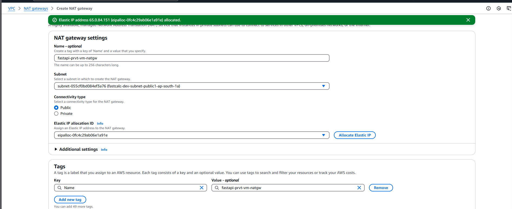

1. After natgate creation:

   > 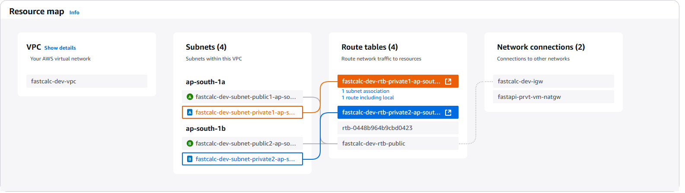

1. Make entry in Route table for Private Subnets to connect natgate for internet access.

1. 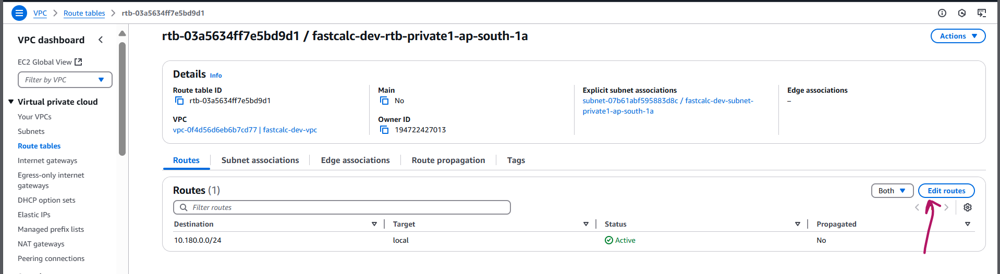
1. 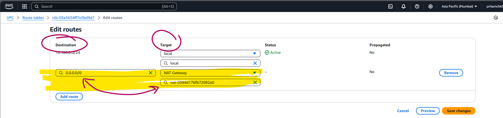
1. Check VPC flow diag.
   - 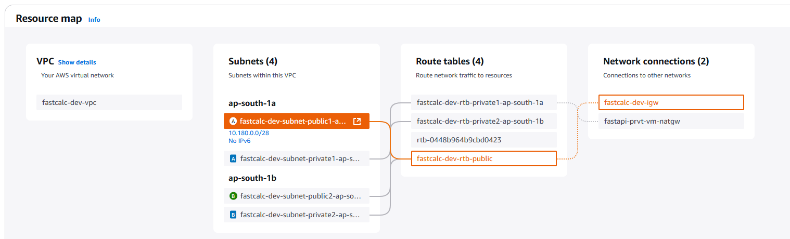
1. Now repeat same for the other vm in other AZ
   - 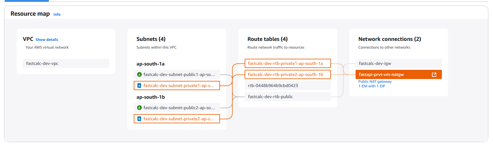
1. Now both VM can ping to internet.
   - 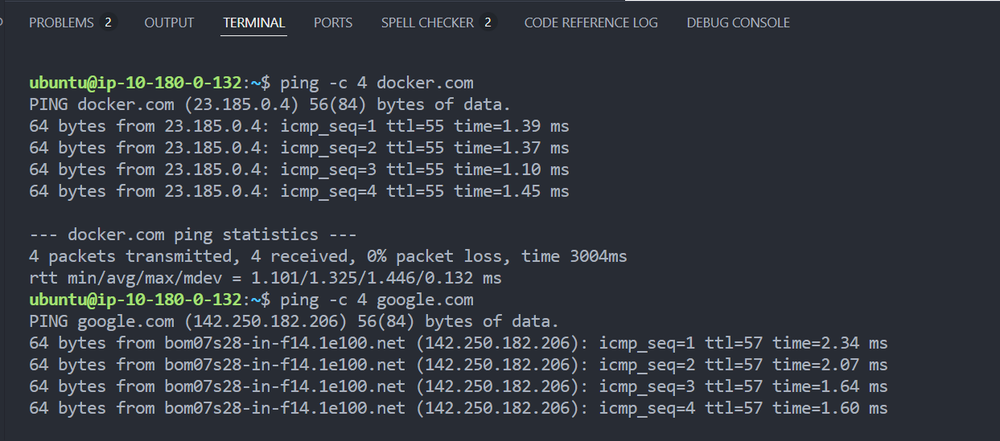
   - 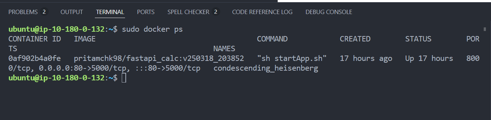
1. Target Group for Vm1 and VM2 in Private Subnet :
   - 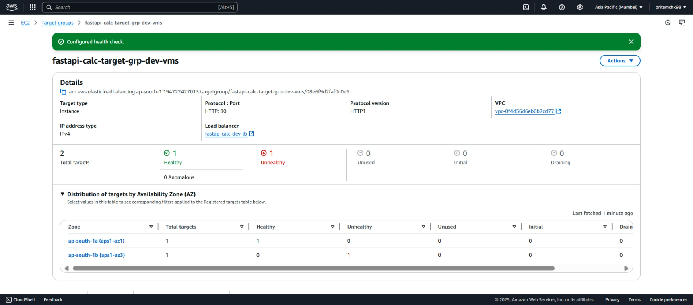
1. Load Balancer (working):
   - 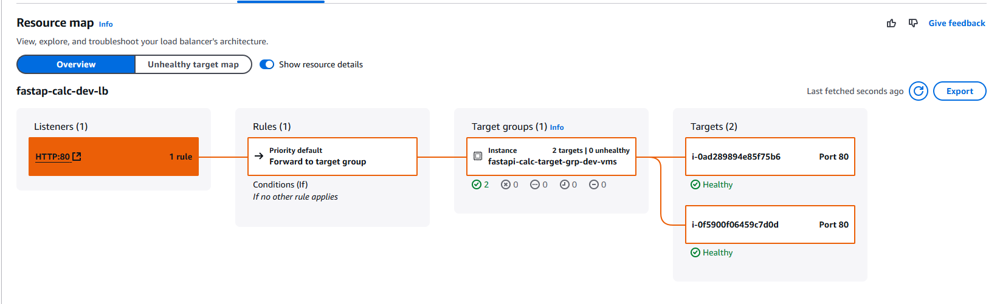
1. Hosted App and the log for both VM:
   - 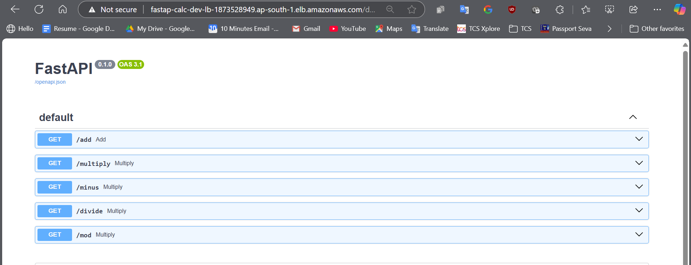
   - 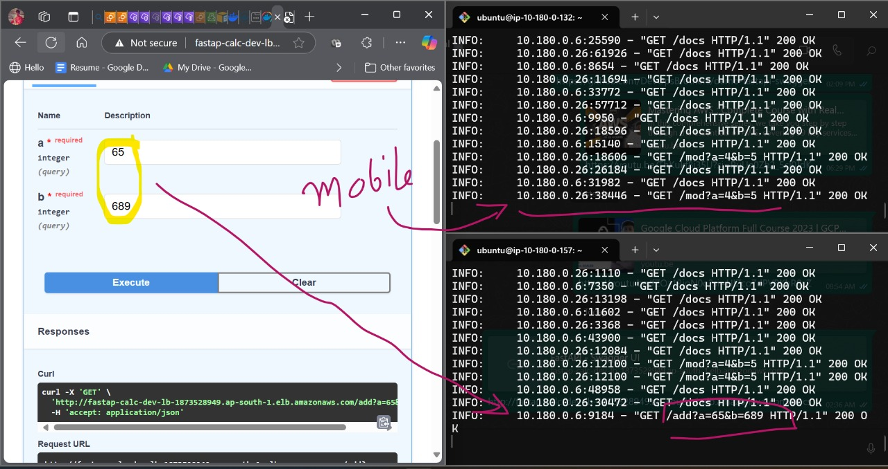
