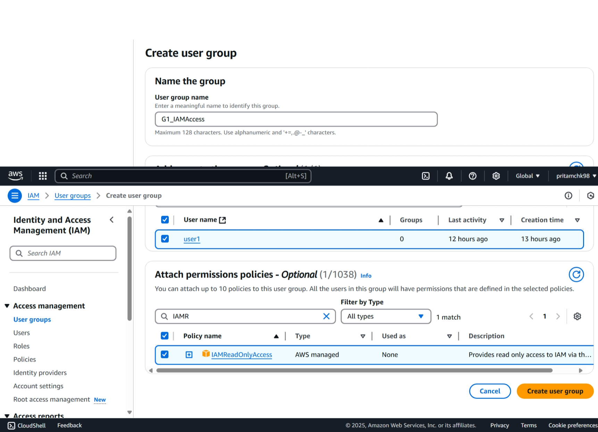

# aws-learning-handson

> this repo is created store all learning and handson practice of aws IAM service

## Tech Stack


<!-- ```md

``` -->

---

## How to create user

---

> **TYPE: free**


---

1. search for IAM in search section
1. Open service , click hamburger --> check out left panel.
1. Click on user --> create new user.
   1. User can be created with default settings.
   1. user can be assigned to a group which is having certain policies applied
   1. individual user can be assigned policies.
1. Create user with autogenerated password enable and force password change on first login.
1. Post user creation share creds with the user and they have to login as IAM user from UI or below kind of link can be shared with user.
   - `https://194722427013.signin.aws.amazon.com/console` - where **user id of IAM user** is -**`194722427013`**

---

## How to create group

> from IAM we can create group



1. Created one group called **G1_IAMAccess** where user can have only read access to
1. Now logged in with user one and tried to remove the `user1` from group | result below (expected):
   - > 
1. But as `user1` has read access - it can only view.
   - 
